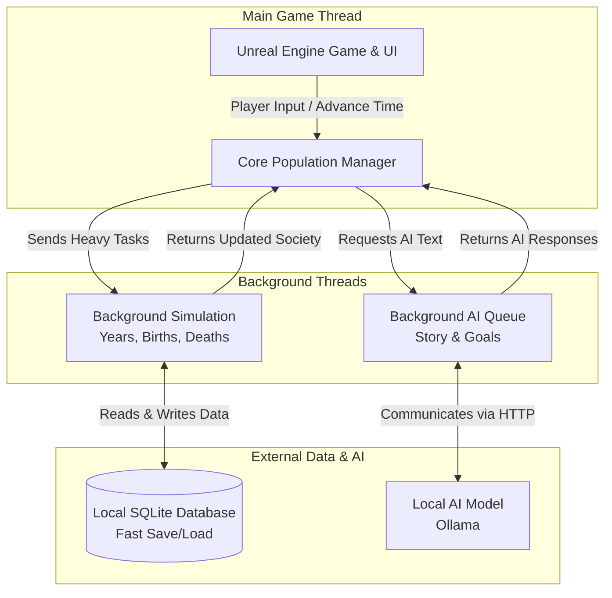

# LineageAI: High-Performance Society Simulation Architecture

> **Note:** This repository serves as an architectural showcase and case study. It contains selected C++ infrastructure files demonstrating the core systems of LineageAI. The proprietary generation algorithms have been omitted.

## Project Overview
LineageAI is a high-performance C++ plugin for Unreal Engine 5 designed to generate, simulate, and manage complex NPC societies over extended timeframes. By offloading calculations to asynchronous threads, leveraging a local SQLite database for persistent memory, and integrating Ollama for LLM-driven event generation, LineageAI simulates thousands of entities concurrently while maintaining target frame rates.

## Architecture Overview

LineageAI uses a modular subsystem architecture to separate logic, memory, and AI generation, ensuring thread safety and scalability.

## Core Features & Implementation

Instead of showing the proprietary simulation algorithms, this showcase highlights how the underlying infrastructure was built to handle massive scale.

### 1. Asynchronous World Generation
Creating a new society from scratch involves generating thousands of founder characters, assigning traits, and building the initial world state (`StartNewSimulationAsync`). To prevent the game from freezing during this heavy setup, the entire generation process is offloaded to background threads. The UI remains fully responsive, displaying loading progress while the initial database is populated.

### 2. High-Performance Time Simulation
Simulating decades of life events, marriages, births, and mortality requires intense computation. I decoupled this logic from the main Unreal Game Thread (`AdvanceTimeAsync`). The system takes a snapshot of the current population, processes years of simulation math in a worker thread, and then safely synchronizes the updated society state back to the game.

### 3. Efficient Database Management
Standard Unreal save games cannot handle the data footprint of thousands of living and deceased NPCs. I implemented a native, local SQLite database subsystem. By updating the database using batched transactions and compressing complex character data (like family trees and memory logs) into binary arrays (BLOBs), the plugin manages massive data throughput with very low read/write overhead.

### 4. Dynamic AI via Local LLMs
To give characters dynamic personalities and goals, the plugin connects to local LLMs (like Ollama) via custom HTTP requests. Because AI text generation takes time, I built an asynchronous priority job queue (`LineageAILLMSubsystem`). The game continues to run smoothly at high frame rates while the AI "thinks" in the background, seamlessly delivering new goals and life events back to the NPCs once ready.

## Showcase Video

